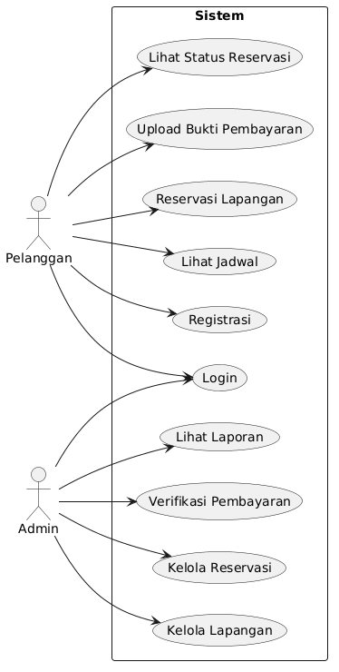
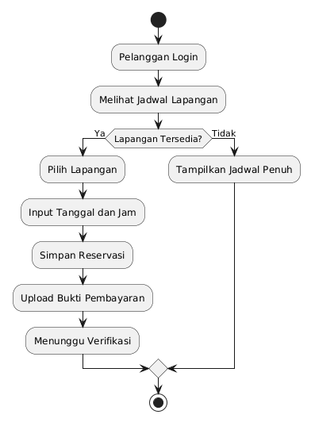
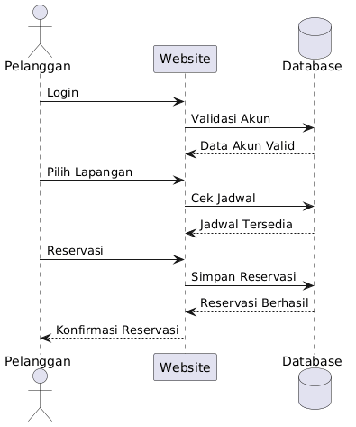

# Analisis dan Perancangan Sistem Informasi Reservasi Lapangan Futsal Berbasis Web

## Deskripsi Proyek

Sistem Informasi Reservasi Lapangan Futsal Berbasis Web merupakan aplikasi yang dirancang untuk memudahkan pelanggan dalam melakukan pemesanan lapangan futsal secara online. Sistem menyediakan fitur registrasi, login, melihat jadwal lapangan, melakukan reservasi, pembayaran, dan pengelolaan data oleh admin.

## Tujuan

- Mempermudah proses reservasi lapangan futsal.
- Mengurangi kesalahan pencatatan jadwal.
- Meningkatkan efisiensi pengelolaan data reservasi.
- Menyediakan informasi ketersediaan lapangan secara real-time.

---

# Business Requirement Document (BRD)

## Latar Belakang

Proses reservasi lapangan futsal yang masih dilakukan secara manual sering menimbulkan masalah seperti bentrok jadwal, kesalahan pencatatan, dan keterlambatan konfirmasi. Oleh karena itu, dibutuhkan sistem berbasis web yang mampu mengelola proses reservasi secara efektif dan efisien.

## Stakeholder

1. Pemilik Usaha Futsal
2. Admin
3. Pelanggan

## Kebutuhan Fungsional

### Pelanggan

- Registrasi akun
- Login
- Melihat jadwal lapangan
- Melakukan reservasi
- Mengunggah bukti pembayaran
- Melihat status reservasi

### Admin

- Login
- Mengelola data lapangan
- Mengelola data pelanggan
- Mengelola reservasi
- Verifikasi pembayaran
- Membuat laporan reservasi

## Kebutuhan Non-Fungsional

- Sistem berbasis web
- Database terintegrasi
- Antarmuka mudah digunakan
- Keamanan login dengan username dan password

---

# Entity Relationship Diagram (ERD)

---

# Data Flow Diagram (DFD) Level 0

---

# Data Flow Diagram (DFD) Level 1

---

# Use Case Diagram

---

# Activity Diagram

---

# Sequence Diagram

---

# Kesimpulan

Sistem Informasi Reservasi Lapangan Futsal Berbasis Web dapat membantu proses pemesanan lapangan menjadi lebih efektif, mengurangi kesalahan pencatatan, serta meningkatkan kualitas pelayanan kepada pelanggan melalui sistem yang terintegrasi.
